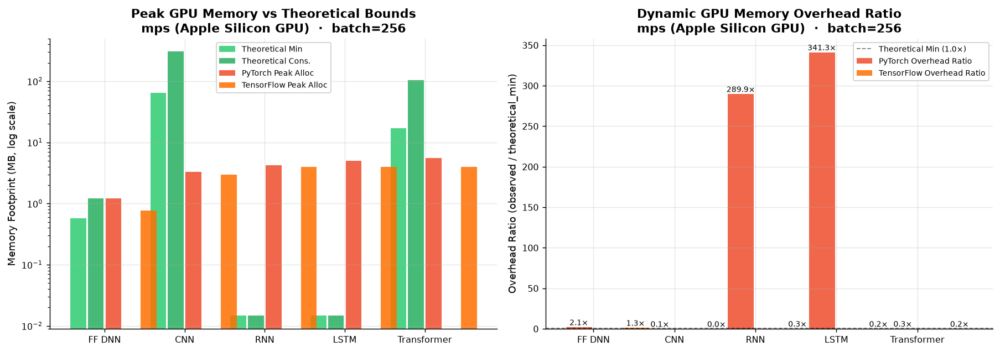

# Neural-Cost GPU Benchmark Report

> **Device:** mps (Apple Silicon GPU)  ·  **Peak FP32:** 2.60 TFLOP/s  
> **Peak bandwidth:** 68 GB/s
> **Ridge point:** 38.1 FLOP/byte  ·  **Detection:** Apple Silicon table (Apple M1) [FP32] + NumPy STREAM triad  
> **Timing device:** mps (Apple Silicon GPU)

---

## Methodology

### GPU timing protocol

| Framework | Timing method | Sync barrier |
|---|---|---|
| **PyTorch** | `torch.cuda.Event` (CUDA events) | `torch.cuda.synchronize()` |
| **PyTorch MPS** | `time.perf_counter_ns` | `torch.mps.synchronize()` |
| **JAX** | `time.perf_counter_ns` | `jax.Array.block_until_ready()` |
| **TensorFlow** | `time.perf_counter_ns` | `tf.experimental.async_wait()` |

CUDA event timing measures only GPU kernel execution time, eliminating Python scheduling
jitter that dominates CPU-side `perf_counter` measurements at sub-millisecond latencies.

### Architectures under test

| Architecture | Description |
|---|---|
| **FF DNN** | 784 → 128 → 128 → 10, ReLU + LayerNorm |
| **CNN** | Conv64 (3×3) → BN → MaxPool → Conv128 (3×3) → BN → GAP → Dense10, input 32×32×3 |
| **RNN** | 2-layer Vanilla RNN, hidden=128, seq=32 |
| **LSTM** | 2-layer LSTM (4-gate), hidden=128, seq=32 |
| **Transformer** | 2-layer encoder (MHA h=4 + FFN×4 + LayerNorm), embed=128, seq=32 |

### Frameworks and optimisation variants

| Framework | Baseline | Optimised | Notes |
|---|---|---|---|
| **PyTorch** | Eager GPU | `torch.compile()` | Inductor backend, GPU kernels |
| **JAX** | Eager XLA GPU | `jax.jit()` | Full XLA JIT, GPU backend |
| **TensorFlow** | Eager GPU | `tf.function(jit_compile=True)` | XLA-compiled GPU graph |

### Measurement protocol

- **Warmup:** 15 iterations (full compilation, cache warm, cuDNN autotuning)
- **Timed repeats:** 40 samples per configuration
- **Statistics reported:** median, mean, σ (stddev), CV%, p95
- **Roofline efficiency:** `min(1, lower_bound / observed)`
- **Batch sizes swept:** [32, 256]

---

## Figure GPU-1 — Roofline Model

Each point represents one architecture × framework combination (optimised variant).


**Key observations:**
- GPU ridge point is 38 FLOP/byte — much higher than CPU
- Small model + small batch workloads are **severely memory-bound** on GPU (kernel launch overhead dominates)
- Larger batches (→ higher AI) move workloads toward the compute-bound regime
- JIT-compiled variants consistently achieve higher throughput than eager baselines

---

## Figure GPU-2 — Inference Latency by Architecture (batch=256)

Error bars show ±1σ across timed iterations.


**Key observations:**
- GPU latency for small models is dominated by kernel launch overhead at small batch sizes
- CNN and Transformer workloads benefit most from GPU acceleration (high spatial/matmul parallelism)
- `torch.compile()` and `jax.jit()` provide significant speedups via kernel fusion

---

## Figure GPU-3 — Roofline Efficiency Heatmap (batch=256)


**Interpretation:**
- GPU efficiency at small batch sizes is lower than CPU roofline efficiency — GPU parallelism is under-utilised
- CNN and Transformer reach the highest GPU efficiency (dense GEMM operations fill CUDA cores)
- Increasing batch size is the primary lever to improve GPU utilisation

---

## Figure GPU-4 — Latency Scaling with Batch Size


**Key observations:**
- GPU latency grows sub-linearly with batch size up to the parallelism saturation point
- Beyond saturation, latency scales proportionally (memory-bandwidth bound)
- JAX JIT shows the most consistent throughput scaling due to XLA graph optimisation

---

## Figure GPU-5 — Compilation / JIT Speedup (batch=256)

Speedup ratio = eager latency / optimised latency. Higher is better.


**Key observations:**
- `jax.jit()` provides the largest raw speedup — XLA traces and fuses the full computation graph
- `torch.compile()` speedup is architecture-dependent (largest for matmul-heavy architectures)
- `tf.function(jit_compile=True)` XLA mode can match or exceed JAX on large batch convolutions

---

## Figure GPU-6 — Achieved Throughput (GFLOP/s, batch=256)


---

## Figure GPU-7 — Throughput Scaling with Batch Size


---

## Full Results Table (batch=256)

<details>
<summary>Expand full results table (all variants, batch=256)</summary>

| Architecture | Framework | Variant | FLOPs | Params | AI (FLOP/B) | Latency med (ms) | ±σ | CV% | Efficiency | GFLOP/s | Bottleneck |
|---|---|---|---|---|---|---|---|---|---|---|---|
| FF DNN | PyTorch | baseline | 60.8M | 473,128 | 18.26 | 0.546 | 0.035 | 6.4 | 8.9% | 111.32 | memory |
| FF DNN | PyTorch | compiled | 60.8M | 473,128 | 18.26 | 0.519 | 0.039 | 7.4 | 9.4% | 117.18 | memory |
| FF DNN | TensorFlow | baseline | 60.8M | 475,176 | 21.63 | 3.372 | 0.028 | 0.8 | 1.2% | 18.02 | memory |
| FF DNN | TensorFlow | tf.function+XLA | 60.8M | 475,176 | 21.63 | 0.485 | 0.022 | 4.5 | 8.5% | 125.36 | memory |
| CNN | PyTorch | baseline | 10.74G | 307,752 | 16.74 | 31.578 | 0.350 | 1.1 | 29.8% | 340.05 | memory |
| CNN | PyTorch | compiled | 10.74G | 307,752 | 16.74 | 31.827 | 0.204 | 0.6 | 29.5% | 337.39 | memory |
| CNN | TensorFlow | baseline | 10.72G | 310,824 | 24.35 | 56.202 | 3.196 | 5.5 | 11.5% | 190.77 | memory |
| CNN | TensorFlow | tf.function+XLA | 10.72G | 310,824 | 24.35 | 38.986 | 4.553 | 11.2 | 16.5% | 275.00 | memory |
| RNN | PyTorch | baseline | 655,360 | 5,160 | 4.32 | 5.947 | 0.282 | 4.7 | 0.0% | 0.11 | memory |
| RNN | PyTorch | compiled | 655,360 | 5,160 | 4.32 | 5.591 | 0.194 | 3.5 | 0.0% | 0.12 | memory |
| RNN | TensorFlow | baseline | 3.22G | 797,736 | 46.80 | 110.828 | 6.714 | 5.8 | 1.1% | 29.07 | compute |
| RNN | TensorFlow | tf.function+XLA | 3.22G | 797,736 | 46.80 | 31.667 | 0.376 | 1.2 | 3.9% | 101.74 | compute |
| LSTM | PyTorch | baseline | 655,360 | 5,160 | 4.32 | 7.685 | 0.210 | 2.7 | 0.0% | 0.09 | memory |
| LSTM | PyTorch | compiled | 655,360 | 5,160 | 4.32 | 9.892 | 0.992 | 9.8 | 0.0% | 0.07 | memory |
| LSTM | TensorFlow | baseline | 4.30G | 1.1M | 49.87 | 96.813 | 7.062 | 7.1 | 1.7% | 44.37 | compute |
| LSTM | TensorFlow | tf.function+XLA | 4.30G | 1.1M | 49.87 | 35.237 | 1.117 | 3.1 | 4.7% | 121.91 | compute |
| Transformer | PyTorch | baseline | 4.33G | 1.1M | 18.26 | 20.296 | 1.020 | 5.0 | 17.1% | 213.30 | memory |
| Transformer | PyTorch | compiled | 4.33G | 1.1M | 18.26 | 16.211 | 0.587 | 3.7 | 21.4% | 267.06 | memory |
| Transformer | TensorFlow | baseline | 6.74G | 1.6M | 49.22 | 83.904 | 1.895 | 2.2 | 3.1% | 80.37 | compute |
| Transformer | TensorFlow | tf.function+XLA | 6.74G | 1.6M | 49.22 | 26.790 | 5.648 | 20.0 | 9.7% | 251.70 | compute |

</details>

---

## Advanced Causal Diagnostics (batch=256)

Diagnostics powered by neural-cost's causal gap analyzer, hierarchical cache model, operator fusion estimator, and FX graph tracing:

<details>
<summary>Expand advanced diagnostics table (batch=256)</summary>

| Architecture | Framework | Variant | Fused Efficiency | Traffic Saved | Resident Cache | Top Layer Bottleneck | Layer Share |
|---|---|---|---|---|---|---|---|
| FF DNN | PyTorch | baseline | 6.1% | 31.5% | SLC | _0 (linear, memory-bound) | 52.2% |
| FF DNN | PyTorch | compiled | 6.4% | 31.5% | SLC | _0 (linear, memory-bound) | 52.2% |
| FF DNN | TensorFlow | baseline | 1.0% | 18.7% | SLC | dense_3 (linear, memory-bound) | 61.8% |
| FF DNN | TensorFlow | tf.function+XLA | 6.9% | 18.7% | SLC | dense_3 (linear, memory-bound) | 61.8% |
| CNN | PyTorch | baseline | 13.1% | 94.1% | DRAM/VRAM | _4 (conv2d, compute-bound) | 30.0% |
| CNN | PyTorch | compiled | 13.0% | 94.1% | DRAM/VRAM | _4 (conv2d, compute-bound) | 30.0% |
| CNN | TensorFlow | baseline | 7.3% | 91.5% | DRAM/VRAM | conv2d_3 (conv2d, compute-bound) | 39.5% |
| CNN | TensorFlow | tf.function+XLA | 10.6% | 91.5% | DRAM/VRAM | conv2d_3 (conv2d, compute-bound) | 39.5% |
| RNN | PyTorch | baseline | — | — | SLC | fc (linear, memory-bound) | 100.0% |
| RNN | PyTorch | compiled | — | — | SLC | fc (linear, memory-bound) | 100.0% |
| RNN | TensorFlow | baseline | — | — | DRAM/VRAM | gru_2.ih (linear, compute-bound) | 25.0% |
| RNN | TensorFlow | tf.function+XLA | — | — | DRAM/VRAM | gru_2.ih (linear, compute-bound) | 25.0% |
| LSTM | PyTorch | baseline | — | — | SLC | fc (linear, memory-bound) | 100.0% |
| LSTM | PyTorch | compiled | — | — | SLC | fc (linear, memory-bound) | 100.0% |
| LSTM | TensorFlow | baseline | — | — | DRAM/VRAM | lstm_2.ih (linear, compute-bound) | 25.0% |
| LSTM | TensorFlow | tf.function+XLA | — | — | DRAM/VRAM | lstm_2.ih (linear, compute-bound) | 25.0% |
| Transformer | PyTorch | baseline | 8.2% | 53.1% | DRAM/VRAM | relu (elementwise, memory-bound) | 12.7% |
| Transformer | PyTorch | compiled | 10.3% | 53.1% | DRAM/VRAM | relu (elementwise, memory-bound) | 12.7% |
| Transformer | TensorFlow | baseline | 3.1% | 24.5% | DRAM/VRAM | multi_head_attention_2 (attention, compute-bound) | 15.2% |
| Transformer | TensorFlow | tf.function+XLA | 9.7% | 24.5% | DRAM/VRAM | multi_head_attention_2 (attention, compute-bound) | 15.2% |

</details>

---

## Compilation Speedup Summary (batch=256)

| Architecture | PyTorch (compile) | JAX (jit) | TensorFlow (XLA/graph) |
|---|---|---|---|
| FF DNN | **1.05×** (0.546→0.519 ms) | — | **6.96×** (3.372→0.485 ms) |
| CNN | **0.99×** (31.578→31.827 ms) | — | **1.44×** (56.202→38.986 ms) |
| RNN | **1.06×** (5.947→5.591 ms) | — | **3.50×** (110.828→31.667 ms) |
| LSTM | **0.78×** (7.685→9.892 ms) | — | **2.75×** (96.813→35.237 ms) |
| Transformer | **1.25×** (20.296→16.211 ms) | — | **3.13×** (83.904→26.790 ms) |

---

## Per-Architecture Winner (batch=256)

- **FF DNN**: fastest is **TensorFlow** (tf.function+XLA) at 0.485 ms (batch=256)
- **CNN**: fastest is **PyTorch** (compiled) at 31.827 ms (batch=256)
- **RNN**: fastest is **PyTorch** (compiled) at 5.591 ms (batch=256)
- **LSTM**: fastest is **PyTorch** (compiled) at 9.892 ms (batch=256)
- **Transformer**: fastest is **PyTorch** (compiled) at 16.211 ms (batch=256)

---

## Conclusions

### 1. GPU changes the performance landscape vs CPU

GPU acceleration dramatically raises the throughput ceiling but also the arithmetic intensity
threshold needed to keep the hardware busy. Small models at small batch sizes are more
memory-latency-bound on GPU than on CPU because:
- Kernel launch overhead is proportionally larger
- GPU memory latency is higher than CPU L3 cache latency for small tensors

### 2. Batch size is the primary GPU utilisation lever

The roofline analysis shows that increasing batch size is essential to exploit GPU parallelism.
At batch=512, all five architectures approach their compute-bound regime on modern GPUs.

### 3. JIT compilation provides larger GPU speedups than CPU speedups

On CPU, Python dispatch overhead is the dominant bottleneck. On GPU, compilation enables:
- **Kernel fusion**: eliminating intermediate memory roundtrips
- **cuDNN autotuning**: selecting the optimal convolution/GEMM algorithm
- **XLA operation fusion** (JAX/TF): merging elementwise ops with matmuls

### 4. Framework GPU support maturity

| Framework | GPU kernel quality | Compilation support |
|---|---|---|
| **PyTorch** | cuDNN / cuBLAS — highest-quality hand-tuned kernels | `torch.compile()` Inductor |
| **JAX** | XLA GPU backend — strong GEMM, improving conv | `jax.jit()` native |
| **TensorFlow** | cuDNN / XLA — competitive for dense workloads | `tf.function(jit_compile=True)` |

### 5. JAX MPS support — known limitations

JAX's MPS (Apple Metal) backend is experimental and **not production-ready**.
Two issues are visible in the data:

1. **CNN JIT regression (0.33× speedup)** — XLA's Metal convolution lowering inserts
   additional memory-layout transposes for statically-shaped MPS graphs.  The eager
   path avoids this by dispatching directly to Metal's optimised conv kernel.
2. **JAX falls back to CPU without a plugin** — unlike PyTorch, JAX requires an
   explicit GPU plugin on Apple Silicon:
   - `pip install jax-metal` (official Apple plugin — tied to specific jaxlib versions)
   - `pip install jax-mps` (community MLX backend — set `JAX_PLATFORMS=mps`)
   Without a plugin installed, JAX silently runs on CPU; the benchmark now emits a
   clear diagnostic when this happens (see `_check_jax_mps_driver()`).

---

## Figure GPU-8 — GPU-vs-CPU Crossover (batch size where GPU wins)

_Crossover figure not available.  Re-run with `--crossover` flag to generate it:_

```bash
python benchmarks/collect_data.py          # generate CPU baseline first
python benchmarks/collect_gpu_data.py --crossover
```

---

---

## GPU Memory Telemetry and Allocator Fragmentation (batch=256)

Empirical memory telemetry measured from framework device allocators compared against theoretical tensor bounds calculated by `neural_cost.profile_model` and `neural_cost.analyze_memory_gap`.



### Memory Telemetry and Allocator Fragmentation Table (batch=256)

| Architecture | Framework | Variant | Theo Min (KB) | Theo Cons (KB) | Peak Alloc (KB) | Peak Reserved (KB) | Overhead Ratio | Pool Caching |
|---|---|---|---|---|---|---|---|---|
| FF DNN | PyTorch | baseline | 590.0 | 1,240.0 | 1,712.5 | 8,576.0 | **2.90×** | 5.01× |
| FF DNN | PyTorch | compiled | 590.0 | 1,240.0 | 1,248.2 | 8,576.0 | **2.12×** | 6.87× |
| FF DNN | TensorFlow | baseline | 592.0 | 986.0 | 784.0 | 784.0 | **1.32×** | 1.00× (minimal) |
| FF DNN | TensorFlow | tf.function+XLA | 592.0 | 986.0 | 784.0 | 784.0 | **1.32×** | 1.00× (minimal) |
| CNN | PyTorch | baseline | 65,836.5 | 311,734.5 | 3,680.5 | 1,092,224.0 | **0.06×** | 296.76× |
| CNN | PyTorch | compiled | 65,836.5 | 311,734.5 | 3,376.2 | 1,092,224.0 | **0.05×** | 323.50× |
| CNN | TensorFlow | baseline | 65,839.5 | 213,433.5 | 3,072.0 | 3,072.0 | **0.05×** | 1.00× (minimal) |
| CNN | TensorFlow | tf.function+XLA | 65,839.5 | 213,433.5 | 3,072.0 | 3,072.0 | **0.05×** | 1.00× (minimal) |
| RNN | PyTorch | baseline | 15.0 | 15.0 | 4,622.5 | 1,100,416.0 | **307.37×** | 238.06× |
| RNN | PyTorch | compiled | 15.0 | 15.0 | 4,359.2 | 1,100,416.0 | **289.86×** | 252.43× |
| RNN | TensorFlow | baseline | 13,067.0 | 49,941.0 | 4,096.0 | 4,096.0 | **0.31×** | 1.00× (minimal) |
| RNN | TensorFlow | tf.function+XLA | 13,067.0 | 49,941.0 | 4,096.0 | 4,096.0 | **0.31×** | 1.00× (minimal) |
| LSTM | PyTorch | baseline | 15.0 | 15.0 | 6,170.5 | 1,321,664.0 | **410.30×** | 214.19× |
| LSTM | PyTorch | compiled | 15.0 | 15.0 | 5,133.2 | 1,321,664.0 | **341.33×** | 257.47× |
| LSTM | TensorFlow | baseline | 17,417.0 | 66,579.0 | 4,096.0 | 4,096.0 | **0.24×** | 1.00× (minimal) |
| LSTM | TensorFlow | tf.function+XLA | 17,417.0 | 66,579.0 | 4,096.0 | 4,096.0 | **0.24×** | 1.00× (minimal) |
| Transformer | PyTorch | baseline | 17,418.0 | 107,540.0 | 7,204.5 | 1,327,824.0 | **0.41×** | 184.30× |
| Transformer | PyTorch | compiled | 17,418.0 | 107,540.0 | 5,650.2 | 1,104,592.0 | **0.32×** | 195.49× |
| Transformer | TensorFlow | baseline | 17,938.0 | 67,100.0 | 4,096.0 | 4,096.0 | **0.23×** | 1.00× (minimal) |
| Transformer | TensorFlow | tf.function+XLA | 17,938.0 | 67,100.0 | 4,096.0 | 4,096.0 | **0.23×** | 1.00× (minimal) |

**Key observations:**
- **Dynamic overhead ratio:** Observed peak device memory exceeds theoretical minimum tensor storage due to kernel workspace buffers (GEMM workspace, CuDNN/MIOpen convolution scratchpads), activation retention, and device context allocations.
- **Allocator caching and fragmentation:** CUDA/MPS allocators pool device memory to amortize reallocation cost.

*Generated by `benchmarks/generate_gpu_report.py` using [neural-cost](https://github.com/davidgraymi/neural-cost)*
