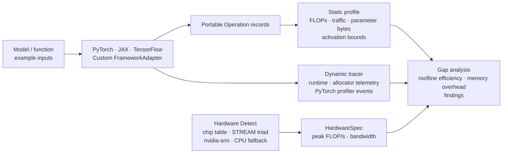

# neural-cost

`neural-cost` estimates a neural network's useful compute and compulsory tensor
traffic, measures its runtime, and uses a roofline lower bound to highlight
likely optimization opportunities. It is intentionally framework-neutral at
its core: PyTorch, TensorFlow, and JAX are optional adapters rather than base
dependencies.

## Install

```bash
pip install -e '.[dev]'
# Choose a framework adapter when needed:
pip install -e '.[torch]'
```

## Architecture



## Analyze portable operations

```python
from neural_cost import HardwareSpec, Operation, analyze_gap, benchmark, estimate_operations, detect_hardware

ops = [Operation("classifier", "linear", ((32, 768), (768, 1000)), (32, 1000), 2)]
estimate = estimate_operations(ops)
measurement = benchmark(lambda: run_inference(), warmup=5, repeats=20)

# Auto-detect or specify manually:
hardware, info = detect_hardware()
# Or: hardware = HardwareSpec("GPU", peak_flops=312e12, memory_bandwidth=1.6e12)
report = analyze_gap(estimate, measurement, hardware)

print(report.render())
```

The theoretical model reports FLOPs, tensor reads/writes, arithmetic intensity,
and a compute/bandwidth lower bound. The measured gap is expected: it captures
launch overhead, synchronization, framework behavior, unfused intermediates,
workspaces, caches, and imperfect kernel utilization.

## Profile static memory and training state

`profile_model` combines FLOP/traffic estimation with parameter and activation
storage bounds. For training, it also models a parameter-sized gradient buffer
and configurable optimizer state; use `optimizer_state_multiplier=2` for
Adam's two moment buffers.

```python
from neural_cost import profile_model
from neural_cost.adapters import TorchAdapter

profile = profile_model(
    model, inputs, TorchAdapter(), training=True, optimizer_state_multiplier=2
)
print(profile.memory.training_minimum_bytes)
```

The minimum activation bound is the largest output tensor. The conservative
bound assumes all forward outputs remain live, so real allocator telemetry is
the source of truth for physical VRAM use.

## Hardware detection

Auto-detection via `detect_hardware()` returns a `(HardwareSpec, DetectionResult)` tuple
to determine hardware peak compute and memory bandwidth:

- **Auto-detection via `detect_hardware()`**: Returns `(HardwareSpec, DetectionResult)` containing roofline specifications and detection provenance.
- **Apple Silicon lookup from chip table**: Identifies Apple Silicon chips (M1–M4 series) and looks up published peak FP32 throughput and memory bandwidth.
- **NumPy STREAM-triad bandwidth benchmark**: Measures live effective memory bandwidth using a STREAM Triad kernel (`c = a + scalar * b`).
- **NVIDIA GPU probe via nvidia-smi**: Probes GPU models, clock rates, and bus specs on systems with NVIDIA GPUs.
- **CPU fallback**: Falls back to CPU logical core counts and clock rates when accelerator probes are unavailable.

```python
from neural_cost import detect_hardware

hardware, info = detect_hardware()
print(f"Device: {hardware.device_name} ({info.source})")
print(f"Peak FLOP/s: {hardware.peak_flops / 1e12:.1f} TFLOP/s")
print(f"Bandwidth: {hardware.memory_bandwidth / 1e9:.1f} GB/s")
```

## Framework adapters

```python
import torch
from neural_cost import estimate_model
from neural_cost.adapters import TorchAdapter

model = torch.nn.Sequential(torch.nn.Linear(128, 64), torch.nn.ReLU(), torch.nn.Linear(64, 10))
inputs = (torch.randn(16, 128),)
estimate = estimate_model(model, inputs, TorchAdapter())
measurement = TorchAdapter().benchmark(model, *inputs)
```

`TorchAdapter` captures `Linear` and `Conv2d` modules and synchronizes CUDA
benchmarks. Its `trace` method uses `torch.profiler` and returns aggregate
profiler-event and CUDA allocator statistics. `TensorFlowAdapter` captures
Keras `Dense` and `Conv2D` calls and returns supported TensorFlow GPU allocator
statistics.
`JaxAdapter` traces conventional `dot_general` and common elementwise jaxpr
primitives and waits for asynchronous device work during benchmarks. All
adapters are optional imports:

```python
from neural_cost.adapters import JaxAdapter, TensorFlowAdapter, TorchAdapter
```

## Compare framework results

The end-to-end tests run a common small matrix-multiply workload for each
installed framework and automatically skip missing optional dependencies:

```bash
uv run --extra dev python -m pytest tests/ -v
# or:
pip install -e '.[dev,torch,jax,tensorflow]'
python -m pytest tests/ -v
```

For a human-readable comparison using a larger shared workload, install the
frameworks you want to compare and run the example. Hardware is auto-detected by
default:

```bash
pip install -e '.[torch,jax,tensorflow]'
python examples/compare_frameworks.py
```

Explicit overrides are optional if you want to provide known hardware specs (hardware is auto-detected by default):

```bash
# Optional overrides with known hardware specs:
python examples/compare_frameworks.py --peak-flops 312e12 --memory-bandwidth 1.6e12
```

## Custom frameworks

Subclass `FrameworkAdapter` and implement `operations(model, example_inputs)`
to return portable `Operation` records. The adapter can also override
`benchmark` to synchronize an accelerator or collect framework-specific memory
statistics. This contract keeps model extraction separate from the framework-
independent estimator and analyzer.

## CLI

```bash
# After pip install:
neural-cost-compare
# Or with overrides:
neural-cost-compare --peak-flops 3.6e12 --memory-bandwidth 100e9
```

## Current scope

The package profiles concrete-shape dense, matrix-multiply, convolution, and
common elementwise inference graphs, alongside supported operations for
`softmax`, `layernorm`, `batchnorm`, and `pooling`. Static training storage
includes gradients and optimizer state but does not yet trace a full backward
graph. Activation checkpointing, distributed communication, dynamic shapes,
fusion details, complete graph coverage, and non-PyTorch kernel-level traces
remain deliberate next increments rather than silently approximated.
