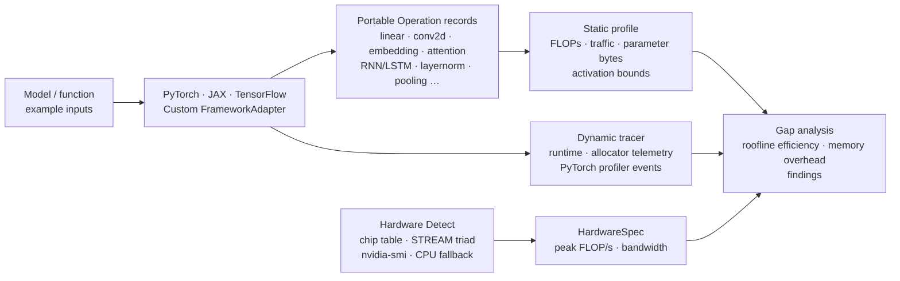

# neural-cost

`neural-cost` estimates a neural network's useful compute and compulsory tensor
traffic, measures its runtime, and uses a roofline lower bound to highlight
likely optimization opportunities.  It is intentionally framework-neutral at
its core: PyTorch, TensorFlow, and JAX are optional adapters rather than base
dependencies.

## Install

```bash
pip install -e '.[dev]'
# Choose one or more framework adapters:
pip install -e '.[torch]'
pip install -e '.[torch,jax,tensorflow]'
```

## Architecture



## Supported operation kinds

| Kind | Description |
|---|---|
| `linear` | Dense / fully-connected projection |
| `conv2d` | 2-D convolution (NCHW / OIHW) |
| `matmul` | Raw matrix multiply |
| `embedding` | Token embedding lookup (read-only traffic model) |
| `attention` | Multi-head self-attention (QKV projections + softmax + output) |
| `elementwise` | Point-wise ops (ReLU, exp, tanh, …) |
| `softmax` / `layernorm` / `batchnorm` | Normalisation ops |
| `pooling` | Max / average / global-average pooling |
| `custom` | Caller-supplied explicit FLOP count |

Adapters automatically emit the right kind for each layer type:

| Framework | Captured layer types |
|---|---|
| **PyTorch** | `Linear`, `Conv2d`, `Embedding`, `RNN`, `GRU`, `LSTM`, `MultiheadAttention`, `LayerNorm`, `BatchNorm1d/2d` |
| **TensorFlow** | `Dense`, `Conv2D`, `Embedding`, `GRU`, `LSTM`, `MultiHeadAttention`, `BatchNormalization`, `LayerNormalization`, pooling layers |
| **JAX** | `dot_general` (matmul), `conv_general_dilated` (conv2d), common elementwise jaxpr primitives |

## Analyze portable operations

```python
from neural_cost import HardwareSpec, Operation, analyze_gap, benchmark, estimate_operations, detect_hardware

ops = [Operation("classifier", "linear", ((32, 768), (768, 1000)), (32, 1000), 2)]
estimate = estimate_operations(ops)
measurement = benchmark(lambda: run_inference(), warmup=5, repeats=20)

# Auto-detect or specify manually:
hardware, info = detect_hardware()
# Or: hardware = HardwareSpec("GPU", peak_flops=312e12, memory_bandwidth=1.6e12)
report = analyze_gap(estimate, measurement, hardware)

print(report.render())
```

The theoretical model reports FLOPs, tensor reads/writes, arithmetic intensity,
and a compute/bandwidth lower bound.  The measured gap is expected: it captures
launch overhead, synchronization, framework behavior, unfused intermediates,
workspaces, caches, and imperfect kernel utilization.

## Profile static memory and training state

`profile_model` combines FLOP/traffic estimation with parameter and activation
storage bounds.  For training, it also models a parameter-sized gradient buffer
and configurable optimizer state; use `optimizer_state_multiplier=2` for
Adam's two moment buffers.

```python
from neural_cost import profile_model
from neural_cost.adapters import TorchAdapter

profile = profile_model(
    model, inputs, TorchAdapter(), training=True, optimizer_state_multiplier=2
)
print(profile.memory.training_minimum_bytes)
```

The minimum activation bound is the largest output tensor.  The conservative
bound assumes all forward outputs remain live, so real allocator telemetry is
the source of truth for physical VRAM use.

## Hardware detection

Auto-detection via `detect_hardware()` returns a `(HardwareSpec, DetectionResult)` tuple
to determine hardware peak compute and memory bandwidth:

- **Apple Silicon lookup from chip table**: Identifies Apple Silicon chips (M1–M4 series) and looks up published peak FP32 throughput and memory bandwidth.
- **NumPy STREAM-triad bandwidth benchmark**: Measures live effective memory bandwidth using a STREAM Triad kernel (`c = a + scalar * b`).
- **NVIDIA GPU probe via nvidia-smi**: Probes GPU models, clock rates, and bus specs on systems with NVIDIA GPUs.
- **CPU fallback**: Falls back to CPU logical core counts and clock rates when accelerator probes are unavailable.

```python
from neural_cost import detect_hardware

hardware, info = detect_hardware()
print(f"Device: {hardware.device_name} ({info.source})")
print(f"Peak FLOP/s: {hardware.peak_flops / 1e12:.1f} TFLOP/s")
print(f"Bandwidth: {hardware.memory_bandwidth / 1e9:.1f} GB/s")
```

## Framework adapters

```python
import torch
from neural_cost import estimate_model
from neural_cost.adapters import TorchAdapter

model = torch.nn.Sequential(torch.nn.Linear(128, 64), torch.nn.ReLU(), torch.nn.Linear(64, 10))
inputs = (torch.randn(16, 128),)
estimate = estimate_model(model, inputs, TorchAdapter())
measurement = TorchAdapter().benchmark(model, *inputs)
```

`TorchAdapter` captures `Linear`, `Conv2d`, `Embedding`, `RNN`, `GRU`, `LSTM`,
`MultiheadAttention`, `LayerNorm`, and `BatchNorm` modules via forward hooks and
synchronizes CUDA benchmarks.  Its `trace` method uses `torch.profiler` and
returns aggregate profiler-event and CUDA allocator statistics.
`TensorFlowAdapter` captures the equivalent Keras layers and returns supported
TensorFlow GPU allocator statistics.  `JaxAdapter` traces conventional
`dot_general`, `conv_general_dilated`, and common elementwise jaxpr primitives
and waits for asynchronous device work during benchmarks.  All adapters are
optional imports:

```python
from neural_cost.adapters import JaxAdapter, TensorFlowAdapter, TorchAdapter
```

## E2E architecture comparison

Run the architecture comparison script to benchmark five canonical neural
network families side-by-side across all installed frameworks:

```bash
pip install -e '.[torch,jax,tensorflow]'
python examples/architecture_comparison.py
```

The script evaluates **FF DNN**, **CNN**, **RNN**, **LSTM**, and **Transformer**
architectures using a shared hidden dimension (128) and batch size (16).
Hardware is auto-detected; pass `--peak-flops` / `--memory-bandwidth` to override.

## GPU benchmark

Run the GPU benchmark to evaluate the same five architectures on available GPU
accelerators (CUDA, ROCm, MPS, or CPU fallback):

```bash
# Auto-detect GPU (CUDA → MPS → CPU fallback)
python benchmarks/collect_gpu_data.py

# Quick run (fewer batch sizes / repeats)
python benchmarks/collect_gpu_data.py --quick

# Explicit CUDA device
python benchmarks/collect_gpu_data.py --device cuda

# Apple Silicon GPU
python benchmarks/collect_gpu_data.py --device mps

# Override hardware specs (e.g. NVIDIA A100 80 GB)
python benchmarks/collect_gpu_data.py \
  --peak-flops 312e12 --memory-bandwidth 2.0e12
```

Results are written to `benchmarks/results/benchmark_gpu_data.json`.
Generate figures and the full markdown report:

```bash
python benchmarks/generate_gpu_report.py
# → GPU_BENCHMARK_REPORT.md + benchmarks/results/figures/gpu_fig*.png
```

### GPU-vs-CPU crossover analysis

Find the exact batch size at which each architecture first runs faster on GPU than CPU:

```bash
# Collect CPU baseline first (if not already done)
python benchmarks/collect_data.py

# Run GPU benchmark with the fine batch-size grid (1, 4, 8 … 1024)
python benchmarks/collect_gpu_data.py --crossover

# Regenerate report — Figure GPU-8 (crossover plot) will now be included
python benchmarks/generate_gpu_report.py
```

The crossover analysis sweeps `CROSSOVER_BATCH_SIZES = [1, 4, 8, 16, 32, 64, 128, 256, 512, 1024]`
and prints a table showing the first batch at which GPU latency drops below CPU latency.

### JAX on Apple Silicon (MPS / Metal)

JAX requires an explicit GPU plugin to run on Apple Silicon GPUs.
**Without a plugin, JAX silently falls back to CPU** even on MPS-capable machines.
Install one of:

```bash
# Official Apple plugin (tied to specific jaxlib versions — check compatibility)
pip install -e '.[jax-metal]'
# or
pip install jax-metal

# Community MLX backend (set JAX_PLATFORMS=mps)
pip install -e '.[jax-mps]'
# or
pip install jax-mps && JAX_PLATFORMS=mps python benchmarks/collect_gpu_data.py
```

The benchmark now detects whether a plugin is installed and emits a clear diagnostic
when JAX is running on CPU instead of the GPU.

Known JAX MPS limitations (tracked upstream):
- `jax.jit()` **regresses CNN latency 3×** on MPS — XLA's Metal conv lowering inserts
  extra memory-layout transposes for statically-shaped graphs (known bug).
- `jax.jit()` gains are large for LSTM (+1.79×) and Transformer (+1.12×) where XLA
  eliminates intermediate tensor roundtrips.

### CUDA CI pipeline

A GitHub Actions workflow at [`.github/workflows/cuda_benchmark.yml`](.github/workflows/cuda_benchmark.yml)
runs the full GPU benchmark on a **GitHub-hosted GPU larger runner (NVIDIA Tesla T4, CUDA 12.x)**:

```
# Trigger manually from the Actions tab:
#   Actions → CUDA Benchmark → Run workflow

# Or apply the label 'run-cuda-benchmark' to any pull request
```

> **Note:** GPU larger runners are a **paid feature** requiring an Organization plan with
> GPU runner groups configured. The workflow is gated to only run on `workflow_dispatch` or
> the `run-cuda-benchmark` PR label, never on every push, to avoid unexpected spend.
>
> Output artifacts (JSON telemetry + report + figures) are retained for 90 days.

### GPU vs CPU benchmark differences

| Aspect | CPU benchmark | GPU benchmark |
|---|---|---|
| Timing | `time.perf_counter_ns` | CUDA events (`torch.cuda.Event`) |
| Sync barrier | None (CPU executes synchronously) | `torch.cuda.synchronize()` / `block_until_ready()` |
| TF optimised variant | `tf.function` (no XLA) | `tf.function(jit_compile=True)` (XLA GPU) |
| Batch sizes | 1, 8, 32, 128 | 8, 32, 128, 512 |
| Device placement | CPU tensors | `.to(device)` / `jax.device_put` / `tf.device` |

<details>
<summary>Sample output (Apple M3, 3.6 TFLOP/s · 100 GB/s, batch=16, seq=32)</summary>

```
┌─ Hardware ──────────────────────────────────────────────────────────────────
│  Device          : Apple M3
│  Peak FP32       : 3.60 TFLOP/s
│  Peak bandwidth  : 100.0 GB/s  (STREAM triad: 48.6 GB/s)
│  Ridge point     : 36.0 FLOP/byte
│  Detection source: Apple Silicon table (Apple M3) + NumPy STREAM triad
└────────────────────────────────────────────────────────────────────────────

━━━━━━━━━━━━━━━━━━━━━━━━━━━━━━━━━━━━━━━━━━━━━━━━━━━━━━━━━━━━━━━━━━━━━━━━━━━━━━━━━━━━━━━━━━━━━━━━━━━━━━━━━━━━━━━━━━━━━━━━━━━━━━━━━━━━━━━
  FF DNN   (784→128→128→10, LayerNorm)
━━━━━━━━━━━━━━━━━━━━━━━━━━━━━━━━━━━━━━━━━━━━━━━━━━━━━━━━━━━━━━━━━━━━━━━━━━━━━━━━━━━━━━━━━━━━━━━━━━━━━━━━━━━━━━━━━━━━━━━━━━━━━━━━━━━━━━━
Framework         FLOPs     Params    I/O MB      AI   ms(med)     ±ms   effic.       roofline         GFLOP/s     GB/s bound
───────────────────────────────────────────────────────────────────────────────────────────────────────────────────────────────────────
PyTorch            3.8M    475,176       0.6    6.45     0.089   0.059     6.6% [█░░░░░░░░░░░░░░░░░]     42.44     6.58 memory
JAX                3.8M    472,064       0.6    6.43     0.068   0.006     8.6% [██░░░░░░░░░░░░░░░░]     55.26     8.60 memory
TensorFlow         3.8M    475,176       0.6    6.45     1.844   0.124     0.3% [░░░░░░░░░░░░░░░░░░]      2.06     0.32 memory

━━━━━━━━━━━━━━━━━━━━━━━━━━━━━━━━━━━━━━━━━━━━━━━━━━━━━━━━━━━━━━━━━━━━━━━━━━━━━━━━━━━━━━━━━━━━━━━━━━━━━━━━━━━━━━━━━━━━━━━━━━━━━━━━━━━━━━━
  CNN   (3-ch input → Conv64 → Conv128 → GAP → Dense10, 32×32)
━━━━━━━━━━━━━━━━━━━━━━━━━━━━━━━━━━━━━━━━━━━━━━━━━━━━━━━━━━━━━━━━━━━━━━━━━━━━━━━━━━━━━━━━━━━━━━━━━━━━━━━━━━━━━━━━━━━━━━━━━━━━━━━━━━━━━━━
Framework         FLOPs     Params    I/O MB      AI   ms(med)     ±ms   effic.       roofline         GFLOP/s     GB/s bound
───────────────────────────────────────────────────────────────────────────────────────────────────────────────────────────────────────
PyTorch          668.5M    309,288      20.4   32.71     5.046   0.393     4.0% [█░░░░░░░░░░░░░░░░░]    132.48     4.05 memory
JAX              662.2M    306,944      25.7   25.78     2.406   0.202    10.7% [██░░░░░░░░░░░░░░░░]    275.27    10.68 memory
TensorFlow       670.1M    310,824      27.8   24.12     5.226   0.377     5.3% [█░░░░░░░░░░░░░░░░░]    128.23     5.32 memory

━━━━━━━━━━━━━━━━━━━━━━━━━━━━━━━━━━━━━━━━━━━━━━━━━━━━━━━━━━━━━━━━━━━━━━━━━━━━━━━━━━━━━━━━━━━━━━━━━━━━━━━━━━━━━━━━━━━━━━━━━━━━━━━━━━━━━━━
  RNN   (2-layer Vanilla RNN, hidden=128, seq=32)
━━━━━━━━━━━━━━━━━━━━━━━━━━━━━━━━━━━━━━━━━━━━━━━━━━━━━━━━━━━━━━━━━━━━━━━━━━━━━━━━━━━━━━━━━━━━━━━━━━━━━━━━━━━━━━━━━━━━━━━━━━━━━━━━━━━━━━━
Framework         FLOPs     Params    I/O MB      AI   ms(med)     ±ms   effic.       roofline         GFLOP/s     GB/s bound
───────────────────────────────────────────────────────────────────────────────────────────────────────────────────────────────────────
PyTorch           67.1M    267,304       2.4   28.29     1.019   0.176     2.3% [░░░░░░░░░░░░░░░░░░]     65.89     2.33 memory
JAX               33.7M    136,192       6.6    5.14     1.678   0.031     3.9% [█░░░░░░░░░░░░░░░░░]     20.10     3.91 memory
TensorFlow       201.4M    797,736       5.0   40.32    71.243   6.103     0.1% [░░░░░░░░░░░░░░░░░░]      2.83     0.07 compute

━━━━━━━━━━━━━━━━━━━━━━━━━━━━━━━━━━━━━━━━━━━━━━━━━━━━━━━━━━━━━━━━━━━━━━━━━━━━━━━━━━━━━━━━━━━━━━━━━━━━━━━━━━━━━━━━━━━━━━━━━━━━━━━━━━━━━━━
  LSTM   (2-layer LSTM, hidden=128, seq=32)
━━━━━━━━━━━━━━━━━━━━━━━━━━━━━━━━━━━━━━━━━━━━━━━━━━━━━━━━━━━━━━━━━━━━━━━━━━━━━━━━━━━━━━━━━━━━━━━━━━━━━━━━━━━━━━━━━━━━━━━━━━━━━━━━━━━━━━━
Framework         FLOPs     Params    I/O MB      AI   ms(med)     ±ms   effic.       roofline         GFLOP/s     GB/s bound
───────────────────────────────────────────────────────────────────────────────────────────────────────────────────────────────────────
PyTorch          268.5M       1.1M       6.3   42.58     2.856   0.091     2.6% [░░░░░░░░░░░░░░░░░░]     94.00     2.21 compute
JAX              135.5M    529,408      31.5    4.31     4.426   0.134     7.1% [█░░░░░░░░░░░░░░░░░]     30.61     7.11 memory
TensorFlow       268.5M       1.1M       6.3   42.58    43.502   1.862     0.2% [░░░░░░░░░░░░░░░░░░]      6.17     0.14 compute

━━━━━━━━━━━━━━━━━━━━━━━━━━━━━━━━━━━━━━━━━━━━━━━━━━━━━━━━━━━━━━━━━━━━━━━━━━━━━━━━━━━━━━━━━━━━━━━━━━━━━━━━━━━━━━━━━━━━━━━━━━━━━━━━━━━━━━━
  Transformer   (2-layer encoder, embed=128, heads=4, FFN×4, seq=32)
━━━━━━━━━━━━━━━━━━━━━━━━━━━━━━━━━━━━━━━━━━━━━━━━━━━━━━━━━━━━━━━━━━━━━━━━━━━━━━━━━━━━━━━━━━━━━━━━━━━━━━━━━━━━━━━━━━━━━━━━━━━━━━━━━━━━━━━
Framework         FLOPs     Params    I/O MB      AI   ms(med)     ±ms   effic.       roofline         GFLOP/s     GB/s bound
───────────────────────────────────────────────────────────────────────────────────────────────────────────────────────────────────────
PyTorch          421.4M       1.5M       9.5   44.59     1.551   0.211     7.5% [█░░░░░░░░░░░░░░░░░]    271.69     6.09 compute
JAX              201.9M    791,552      10.3   19.57     1.206   0.032     8.6% [██░░░░░░░░░░░░░░░░]    167.38     8.55 memory
TensorFlow       421.4M       1.6M       9.5   44.59    12.630   0.182     0.9% [░░░░░░░░░░░░░░░░░░]     33.37     0.75 compute

━━━━━━━━━━━━━━━━━━━━━━━━━━━━━━━━━━━━━━━━━━━━━━━━━━━━━━━━━━━━━━━━━━━━━━━━━━━━━━━━━━━━━━━━━━━━━━━━━━━━━━━━━━━━━━━━━━━━━━━━━━━━━━━━━━━━━━━
  Per-Architecture × Per-Framework Summary
━━━━━━━━━━━━━━━━━━━━━━━━━━━━━━━━━━━━━━━━━━━━━━━━━━━━━━━━━━━━━━━━━━━━━━━━━━━━━━━━━━━━━━━━━━━━━━━━━━━━━━━━━━━━━━━━━━━━━━━━━━━━━━━━━━━━━━━
  Architecture    PyTorch                       JAX                           TensorFlow
  ────────────────────────────────────────────────────────────────────────────────────────────────────────
  FF DNN           7.7% eff   0.08ms   3.8M FLOPs   10.0% eff   0.06ms   3.8M FLOPs    0.3% eff   1.98ms   3.8M FLOPs
  CNN              3.9% eff   5.29ms 668.5M FLOPs   11.3% eff   2.28ms 662.2M FLOPs    5.1% eff   5.41ms 670.1M FLOPs
  RNN              2.3% eff   1.02ms  67.1M FLOPs    3.9% eff   1.68ms  33.7M FLOPs    0.1% eff  71.24ms 201.4M FLOPs
  LSTM             2.6% eff   2.86ms 268.5M FLOPs    7.1% eff   4.43ms 135.5M FLOPs    0.2% eff  43.50ms 268.5M FLOPs
  Transformer      7.5% eff   1.55ms 421.4M FLOPs    8.6% eff   1.21ms 201.9M FLOPs    0.9% eff  12.63ms 421.4M FLOPs
```

> **Reading the table**
> All architectures are memory-bound on this CPU (AI < ridge point of 36 FLOP/byte).
> Low roofline efficiency across all frameworks reflects framework dispatch overhead
> and small-batch latency — the expected regime for CPU inference.
> JAX's eager XLA compilation delivers the most consistent efficiency across architectures.
> TensorFlow's eager Python dispatch overhead dominates at small batch sizes,
> especially for sequential (RNN/LSTM) workloads.

</details>

## Matrix-multiply workload comparison (original)

For a quick cross-framework sanity check on plain matmul shapes, run:

```bash
pip install -e '.[torch,jax,tensorflow]'
python examples/compare_frameworks.py
```

Optional overrides with known hardware specs:

```bash
python examples/compare_frameworks.py --peak-flops 312e12 --memory-bandwidth 1.6e12
```

## Custom frameworks

Subclass `FrameworkAdapter` and implement `operations(model, example_inputs)`
to return portable `Operation` records.  The adapter can also override
`benchmark` to synchronize an accelerator or collect framework-specific memory
statistics.  This contract keeps model extraction separate from the framework-
independent estimator and analyzer.

## CLI

```bash
# After pip install:
neural-cost-compare
# Or with overrides:
neural-cost-compare --peak-flops 3.6e12 --memory-bandwidth 100e9
```

## Current scope

The package profiles concrete-shape dense, matrix-multiply, convolution,
embedding lookup, multi-head attention, and common elementwise inference graphs,
alongside `softmax`, `layernorm`, `batchnorm`, and `pooling`.  Recurrent layers
(RNN, GRU, LSTM) are modelled as their constituent input→hidden and
hidden→hidden linear projections.  Static training storage includes gradients
and optimizer state but does not yet trace a full backward graph.  Activation
checkpointing, distributed communication, dynamic shapes, fusion details,
complete graph coverage, and non-PyTorch kernel-level traces remain deliberate
next increments rather than silently approximated.
